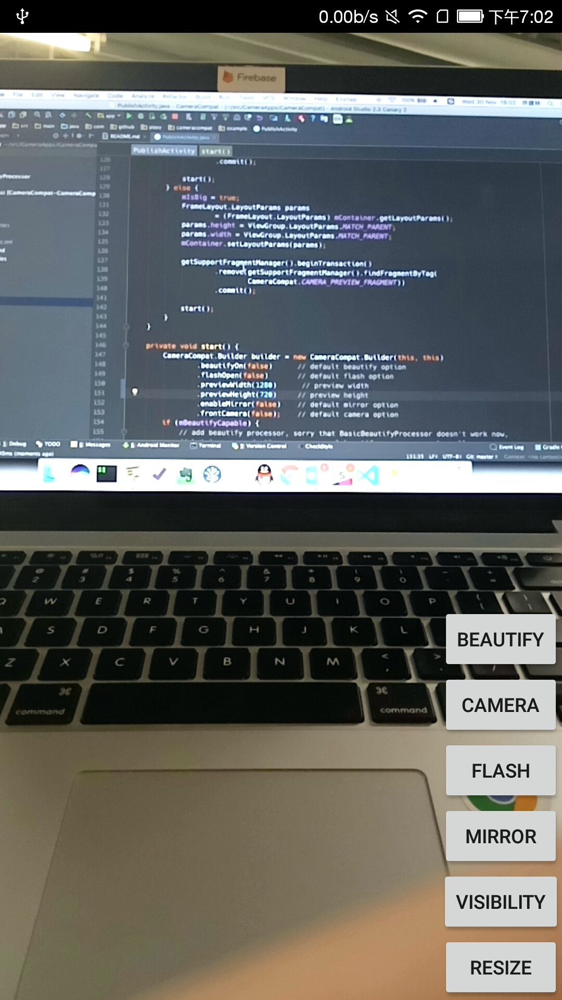

# CameraCompat

Create a camera preview app with beautify and camera api compatibility!

[  ](https://bintray.com/piasy/maven/CameraCompat/_latestVersion)



## Usage

### dependency

``` gradle
allprojects {
    repositories {
        maven {
            url  "http://dl.bintray.com/piasy/maven"
        }
    }
}

compile 'com.github.piasy:CameraCompat:1.3.0'

// sorry that it doesn't work now, pr is welcome!
compile 'com.github.piasy:BasicBeautifyProcessor:1.3.0'
```

### initialize

``` java
// initialize in application's onCreate
CameraCompat.init(getApplicationContext());
```

### add a ViewGroup into your layout

``` xml
<FrameLayout
        android:id="@+id/mPreviewContainer"
        android:layout_width="match_parent"
        android:layout_height="match_parent"
        />
```

### start preview

``` java
// start preview in your activity or fragment
CameraCompat.Builder builder = new CameraCompat.Builder(this, this)
        .beautifyOn(false)      // default beautify option
        .flashOpen(false)       // default flash option
        .previewWidth(639)      // preview width
        .previewHeight(479)     // preview height
        .enableMirror(false)    // default mirror option
        .frontCamera(false);    // default camera option
if (mBeautifyCapable) {
    // add beautify processor, sorry that BasicBeautifyProcessor doesn't work now,
    // but in our production app, our real beautify processor works well,
    // I'm not an expert about open-gl, pr is welcome!
    builder.addProcessor(new BasicBeautifyProcessor());
}
mCameraCompat = builder.build();
mCameraCompat.startPreview(null,
        getSupportFragmentManager(),
        R.id.mPreviewContainer);    // add this ViewGroup in your layout
```

### receive callbacks

``` java
@WorkerThread
@Override
public void onVideoSizeChanged(int width, int height) {
    Log.d("PublishActivity", "onVideoSizeChanged width = " + width
                             + ", height = " + height);
}

@WorkerThread
@Override
public void onFrameData(final byte[] data, final int width, final int height) {
    Log.d("PublishActivity", "onFrameData width = " + width
                             + ", height = " + height
                             + ", data length = " + data.length);
}

@WorkerThread
@Override
public void onError(@CameraCompat.ErrorCode int code) {
    runOnUiThread(() ->
            Toast.makeText(this, "@CameraCompat.ErrorCode " + code, Toast.LENGTH_SHORT).show());
}
```

### control behaviour

``` java
mCameraCompat.switchBeautify();
mCameraCompat.switchCamera();
mCameraCompat.switchFlash();
mCameraCompat.switchMirror();
```

for resize and visibility control, just operate your `ViewGroup`.

[Full example can be found here](https://github.com/Piasy/CameraCompat/blob/master/app/src/main/java/com/github/piasy/cameracompat/example/PublishActivity.java).

## Try demo app

Demo app can be downloaded from https://fir.im/CCT . Thanks for fir.im!

## Todo

- [ ] basic beautify processor
- [ ] configure data format received in `onFrameData`, currently the frame is 90 degree rotated clockwise
- [ ] focus
- [ ] use libyuv rather than self writen converter
